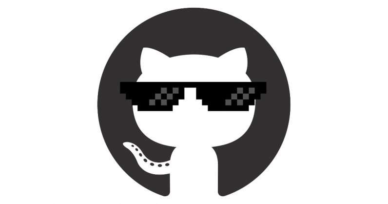

 <h2> 
	👋Olá, eu sou @RAFARZ76!
</h2>
<h3 align = "center"> 🚀 Desenvolvedor Full Stack Jr </h3>

    <a href="https://github.com/RAFARZ76">
    
    
  

  	
	

 
  
 
  
  
  
  
  
  
 

  
	

      <a href="https://github.com/RAFARZ76"><i class="fab fa-github"></i></a>
      <a a class="gitlink" href="https://www.linkedin.com/in/rafael-raizer/"><i class="fab fa-linkedin"></i></a>
      <a href="https://public.tableau.com/app/profile/rafael.raizer"><i class="fab fa-public.tableau"></i></a>
      <a class="tabwhatss" href="https://api.whatsapp.com/send/?phone=47999327137&text&app_absent=0"><i class="fab fa-whastsapp"></i></a></u></strong>

  

     
  

	
 
 
      

